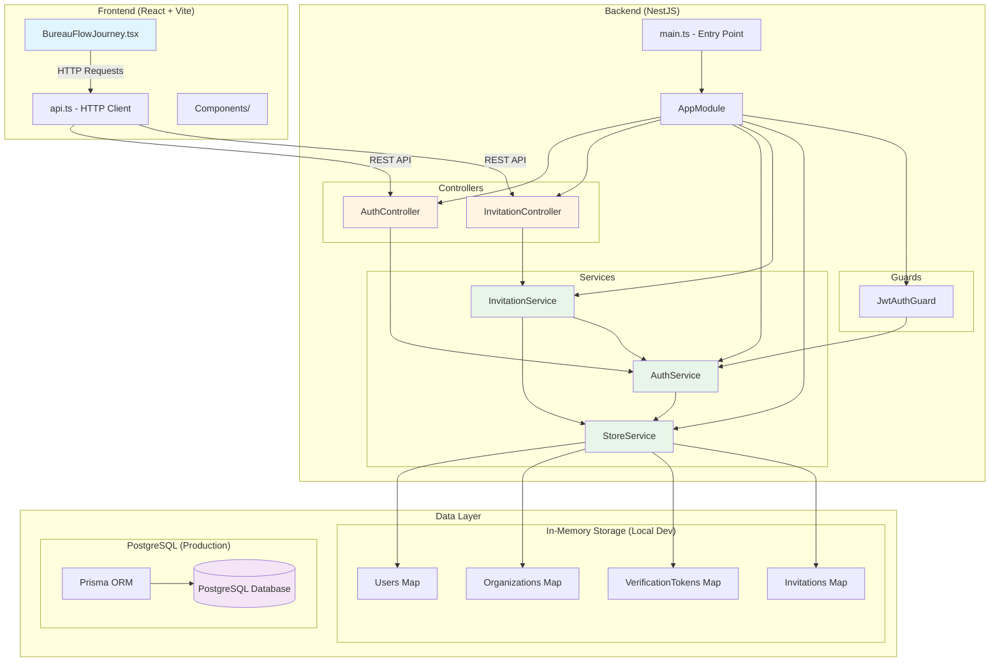
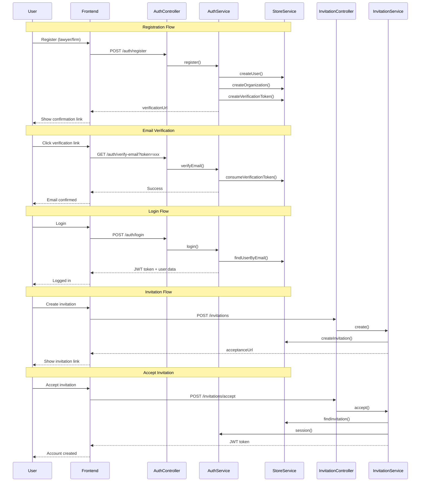

# BureauFlow System Architecture

## Overview
BureauFlow is a legal practice management system for lawyers, law firms, and clients. It handles user registration, email verification, authentication, and client invitations.

## Technology Stack

| Layer | Technologies |
|-------|--------------|
| Front-end | React 18, TypeScript, Vite, Tailwind CSS, Radix UI |
| Back-end | Node.js, NestJS, Prisma ORM, JWT |
| Database | PostgreSQL (production) / In-memory (local dev) |
| Authentication | JWT (8h expiration) |

## System Architecture Diagram



## Data Flow Diagram



## Database Schema

```mermaid
erDiagram
    User ||--o{ VerificationToken : has
    User ||--o{ Invitation : sends
    User ||--o{ Invitation : accepts
    
    User {
        uuid id PK
        string name
        string email UK
        string passwordHash
        Role role
        string phone
        string document
        string oab
        string section
        boolean emailVerified
        datetime createdAt
    }
    
    Organization {
        uuid id PK
        string name
        string document UK
        string address
        string phone
        string responsibleName
        string responsibleEmail
        json lawyers
        uuid ownerId FK
        datetime createdAt
    }
    
    VerificationToken {
        uuid id PK
        string token UK
        uuid userId FK
        datetime expiresAt
        datetime usedAt
        datetime createdAt
    }
    
    Invitation {
        uuid id PK
        string token UK
        string name
        string email
        string message
        datetime expiresAt
        InvitationStatus status
        uuid senderId FK
        uuid recipientId FK
        datetime createdAt
    }
    
    enum Role {
        advogado
        escritorio
        cliente
    }
    
    enum InvitationStatus {
        enviado
        aceito
        expirado
        cancelado
    }
```

## Key Components

### Frontend (`src/`)
- **BureauFlowJourney.tsx**: Main application component implementing the user journey
- **api.ts**: HTTP client with JWT authentication handling
- **components/**: Reusable UI components (49 components)

### Backend (`backend/src/`)
- **main.ts**: NestJS application entry point (port 3000)
- **app.module.ts**: Root module with JWT configuration
- **auth.controller.ts**: Handles registration, login, email verification
- **auth.service.ts**: Authentication logic with bcrypt password hashing
- **invitation.controller.ts**: Manages client invitations
- **invitation.service.ts**: Invitation creation and acceptance logic
- **store.service.ts**: In-memory data storage (for local development)
- **jwt-auth.guard.ts**: JWT authentication guard for protected routes

### Database (`backend/prisma/`)
- **schema.prisma**: PostgreSQL schema with User, Organization, VerificationToken, and Invitation models

## User Journey

1. **Registration**: Lawyer or law firm creates account with organization details
2. **Email Verification**: User clicks confirmation link (displayed in local dev)
3. **Login**: User authenticates with email/password, receives JWT token
4. **Client Invitation**: Lawyer generates time-limited invitation link
5. **Acceptance**: Client accepts invitation, account auto-created with verified email

## API Endpoints

### Auth Endpoints
- `POST /auth/register` - Create new account
- `GET /auth/verify-email?token=xxx` - Verify email address
- `POST /auth/login` - Authenticate user
- `GET /auth/me` - Get current user (JWT protected)

### Invitation Endpoints
- `POST /invitations` - Create invitation (JWT protected)
- `GET /invitations/preview?token=xxx` - Preview invitation details
- `POST /invitations/accept` - Accept invitation and create account

## Security Features

- **Password Hashing**: bcrypt with salt rounds of 12
- **JWT Authentication**: 8-hour token expiration
- **Email Verification**: Required before login
- **Invitation Expiration**: Time-limited client invitations
- **CORS**: Configured for frontend origin
- **Input Validation**: class-validator DTOs on all endpoints

## Development vs Production

### Local Development
- In-memory storage via `StoreService`
- Verification/invitation links displayed in console
- No email provider required
- Default JWT secret for development

### Production
- PostgreSQL database via Prisma ORM
- Real email delivery for verification/invitations
- Environment-configured JWT secret
- Persistent data storage
