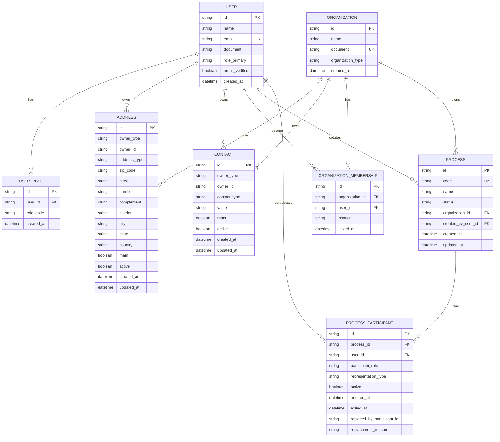

# MER - Modelo Entidade Relacionamento

## Visao conceitual
O modelo privilegia identidade unica da pessoa, papeis acumulativos e participacao contextual em processo.

## Restricoes de negocio mapeadas
1. Processo possui no maximo um PROCESS_PARTICIPANT ativo com participant_role = LEGAL_REPRESENTATIVE.
2. Uma pessoa pode ter N papeis.
3. Uma pessoa pode participar de N processos.
4. Uma organizacao pode ter N processos e N membros.
