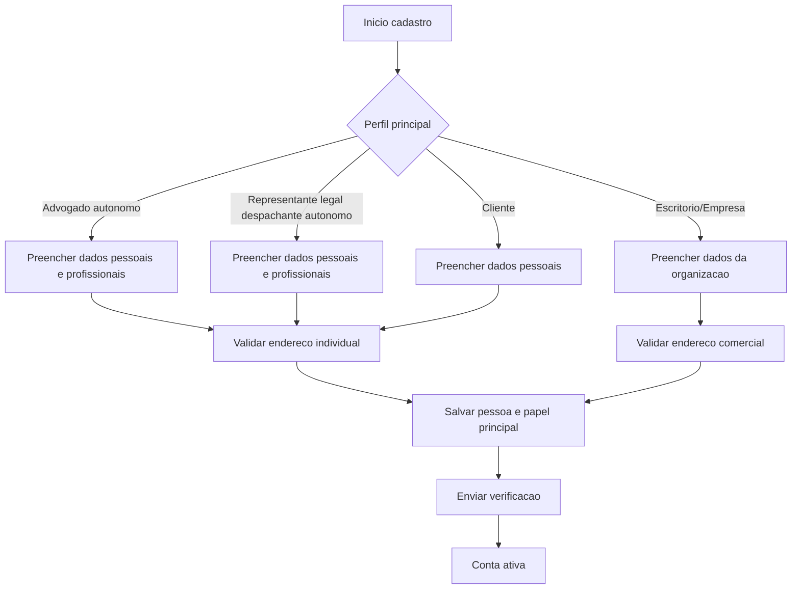
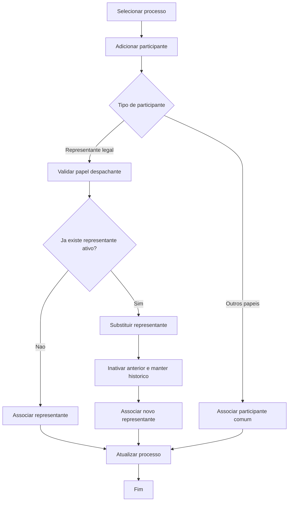
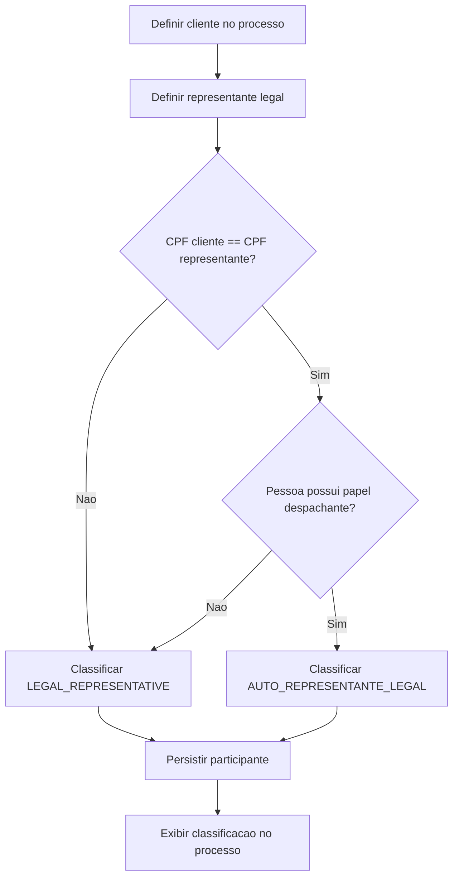

# BPMN - Fluxos principais

## BPMN 1 - Cadastro e ativacao com papeis

```mermaid
flowchart TD
    A[Inicio cadastro] --> B{Perfil principal}
    B -->|Advogado autonomo| C[Preencher dados pessoais e profissionais]
    B -->|Representante legal despachante autonomo| D[Preencher dados pessoais e profissionais]
    B -->|Cliente| E[Preencher dados pessoais]
    B -->|Escritorio/Empresa| F[Preencher dados da organizacao]

    C --> G[Validar endereco individual]
    D --> G
    E --> G
    F --> H[Validar endereco comercial]

    G --> I[Salvar pessoa e papel principal]
    H --> I
    I --> J[Enviar verificacao]
    J --> K[Conta ativa]
```

## BPMN 2 - Nomeacao de representante legal no processo

```mermaid
flowchart TD
    A[Selecionar processo] --> B[Adicionar participante]
    B --> C{Tipo de participante}
    C -->|Representante legal| D[Validar papel despachante]
    D --> E{Ja existe representante ativo?}
    E -->|Nao| F[Associar representante]
    E -->|Sim| G[Substituir representante]
    G --> H[Inativar anterior e manter historico]
    H --> I[Associar novo representante]
    F --> J[Atualizar processo]
    I --> J
    C -->|Outros papeis| K[Associar participante comum]
    K --> J
    J --> L[Fim]
```

## BPMN 3 - Autorrepresentacao automatica

```mermaid
flowchart TD
    A[Definir cliente no processo] --> B[Definir representante legal]
    B --> C{CPF cliente == CPF representante?}
    C -->|Nao| D[Classificar LEGAL_REPRESENTATIVE]
    C -->|Sim| E{Pessoa possui papel despachante?}
    E -->|Nao| D
    E -->|Sim| F[Classificar AUTO_REPRESENTANTE_LEGAL]
    D --> G[Persistir participante]
    F --> G
    G --> H[Exibir classificacao no processo]
```
