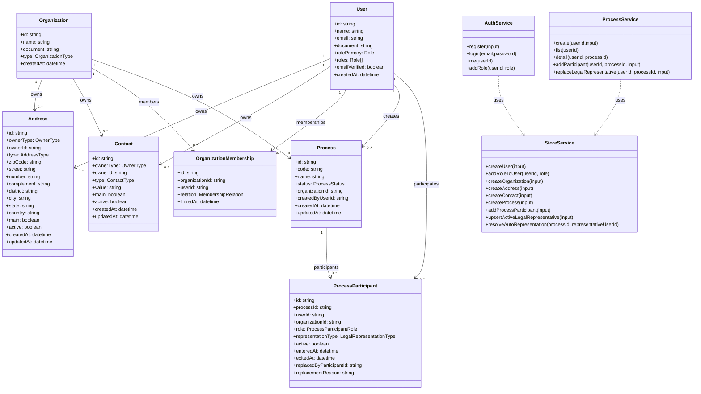

# Diagrama de Classes do Dominio

## Observacoes de regra
1. ProcessParticipant com role LEGAL_REPRESENTATIVE possui no maximo 1 ativo por processo.
2. ProcessService valida autorizacao e papel antes de associar participante critico.
3. StoreService concentra regras de consistencia de participacao e auto-representacao.
