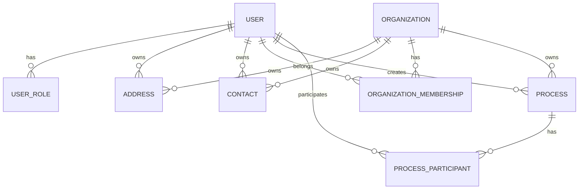
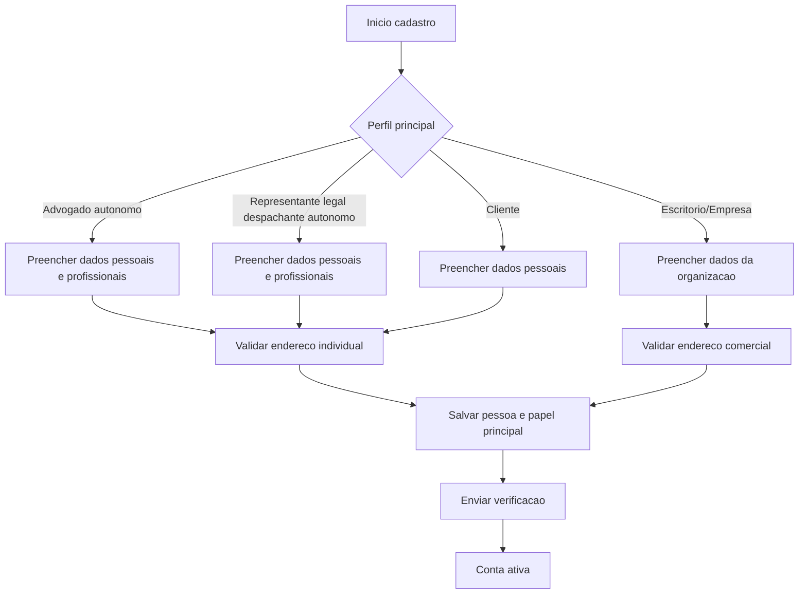
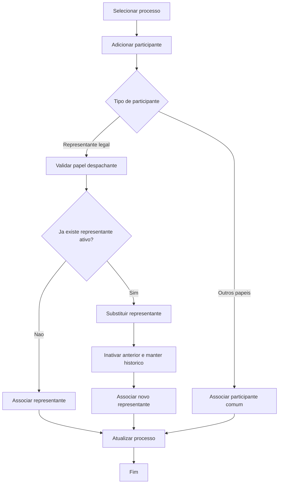
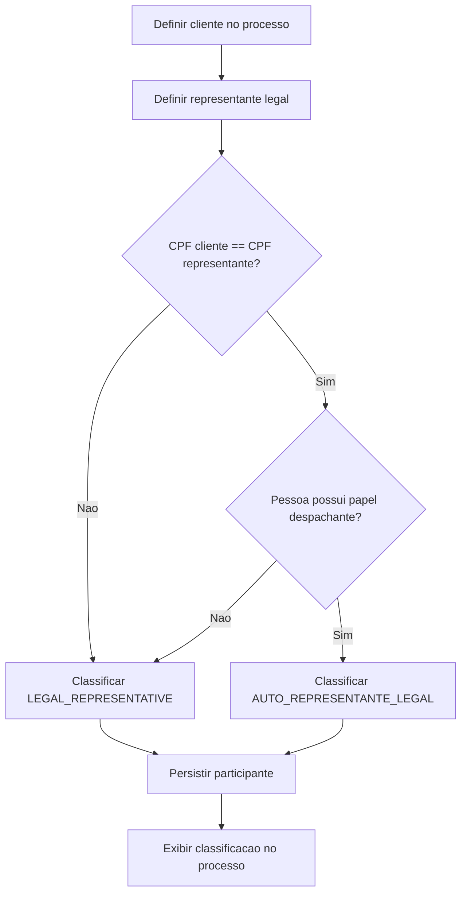
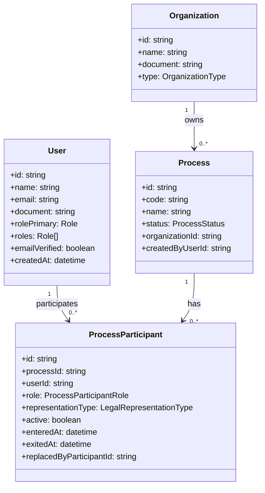

# Anexo de Diagramas - Sprint 06.1

## 1. MER

```mermaid
erDiagram
    USER ||--o{ USER_ROLE : has
    USER ||--o{ ADDRESS : owns
    USER ||--o{ CONTACT : owns
    ORGANIZATION ||--o{ ADDRESS : owns
    ORGANIZATION ||--o{ CONTACT : owns
    USER ||--o{ ORGANIZATION_MEMBERSHIP : belongs
    ORGANIZATION ||--o{ ORGANIZATION_MEMBERSHIP : has
    ORGANIZATION ||--o{ PROCESS : owns
    USER ||--o{ PROCESS : creates
    PROCESS ||--o{ PROCESS_PARTICIPANT : has
    USER ||--o{ PROCESS_PARTICIPANT : participates
```

## 2. BPMN - Cadastro e ativacao

```mermaid
flowchart TD
    A[Inicio cadastro] --> B{Perfil principal}
    B -->|Advogado autonomo| C[Preencher dados pessoais e profissionais]
    B -->|Representante legal despachante autonomo| D[Preencher dados pessoais e profissionais]
    B -->|Cliente| E[Preencher dados pessoais]
    B -->|Escritorio/Empresa| F[Preencher dados da organizacao]
    C --> G[Validar endereco individual]
    D --> G
    E --> G
    F --> H[Validar endereco comercial]
    G --> I[Salvar pessoa e papel principal]
    H --> I
    I --> J[Enviar verificacao]
    J --> K[Conta ativa]
```

## 3. BPMN - Nomeacao de representante legal

```mermaid
flowchart TD
    A[Selecionar processo] --> B[Adicionar participante]
    B --> C{Tipo de participante}
    C -->|Representante legal| D[Validar papel despachante]
    D --> E{Ja existe representante ativo?}
    E -->|Nao| F[Associar representante]
    E -->|Sim| G[Substituir representante]
    G --> H[Inativar anterior e manter historico]
    H --> I[Associar novo representante]
    F --> J[Atualizar processo]
    I --> J
    C -->|Outros papeis| K[Associar participante comum]
    K --> J
    J --> L[Fim]
```

## 4. BPMN - Autorrepresentacao

```mermaid
flowchart TD
    A[Definir cliente no processo] --> B[Definir representante legal]
    B --> C{CPF cliente == CPF representante?}
    C -->|Nao| D[Classificar LEGAL_REPRESENTATIVE]
    C -->|Sim| E{Pessoa possui papel despachante?}
    E -->|Nao| D
    E -->|Sim| F[Classificar AUTO_REPRESENTANTE_LEGAL]
    D --> G[Persistir participante]
    F --> G
    G --> H[Exibir classificacao no processo]
```

## 5. Diagrama de Classes

```mermaid
classDiagram
    class User {
      +id: string
      +name: string
      +email: string
      +document: string
      +rolePrimary: Role
      +roles: Role[]
      +emailVerified: boolean
      +createdAt: datetime
    }

    class Organization {
      +id: string
      +name: string
      +document: string
      +type: OrganizationType
    }

    class Process {
      +id: string
      +code: string
      +name: string
      +status: ProcessStatus
      +organizationId: string
      +createdByUserId: string
    }

    class ProcessParticipant {
      +id: string
      +processId: string
      +userId: string
      +role: ProcessParticipantRole
      +representationType: LegalRepresentationType
      +active: boolean
      +enteredAt: datetime
      +exitedAt: datetime
      +replacedByParticipantId: string
    }

    User "1" --> "0..*" ProcessParticipant : participates
    Organization "1" --> "0..*" Process : owns
    Process "1" --> "0..*" ProcessParticipant : has
```
